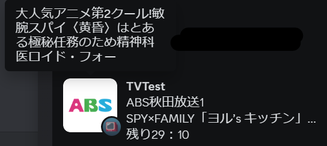

# TvTestRPC

[](https://github.com/stuayu/TVTestRPC/actions/workflows/latest.yml)
[](https://github.com/stuayu/TVTestRPC/releases)

TVTest で Discord Rich Presence を使えるようにするプラグインです。(TVTest ver.0.6.0 or later)
- オプションで SetChannelNameOnDetails=1 にすると以下の表示になります  
  

- オプションで SetChannelNameOnDetails=0 にするとフォーク元と同じ表示になります  
  

## Get Started

ビルド済み成果物は以下からダウンロードできます。

- ワークフロー [](https://github.com/stuayu/TVTestRPC/actions/workflows/latest.yml) のビルド履歴 -> Artifacts
- [](https://github.com/stuayu/TVTestRPC/releases)

## Features

[本家さんバージョン](https://github.com/noriokun4649/TvTestRPC) と [SlashNephy](https://github.com/SlashNephy/TvTestRPC)と同等ですが, 以下の相違点があります。

- TvtPlay プラグインと連携し, ファイル再生時にも経過時間を表示
  - シーク位置を加味して経過時間を計算
- 東京近辺の地上波だけでなく, NHK や BS, 東経110度 CS, 様々な地域の地上波のロゴ表示にも対応
- 視聴中の番組が終了したときに Presence が更新されないバグを修正
- 全角文字を半角に変換するオプションを追加
- サブチャンネル (TOKYO MX2 等) でも Presence を表示
  - サブチャンネルでロゴの色を変えている局にも一部対応しています。

## Station Logos

現在, 次の放送局ロゴに対応しています。ロゴは Wikipedia 上で公開されているもので Public Domain となっています。

- 地上波\
  v2.6.0以降 **全国の地上波民放**と一部CATV事業者(J:COM等)のロゴ表示に対応しています。

- BS  
  2022/03/11 現在の全局に対応しています。
- 東経110度 CS  
  2021/06/03 現在の全局に対応しています。


## Configuration

`TvTestRPC.ini` を編集してください。

```ini
[Settings]
; 番組の終了時刻を Discord に通知します。
; カウントダウンされるようになります。
ShowEndTime=1

; チャンネルロゴを表示します。
ShowChannelLogo=1

; 番組名やチャンネル名の全角文字を半角に変換します。
ConvertToHalfWidth=1

; チューニング空間を無視してチャンネルロゴを適用します。
IgnoreTuningSpace=0

; detailsにチャンネル名と局ロゴ上に番組情報を表示する形式にする
SetChannelNameOnDetails=1

[Logos]
; 特定のサービス ID のロゴを任意に書き換えられます。
; <サービス ID>=<ロゴの Image Key> のペアを記述します。
; 例えば以下の場合, BS11 (サービス ID = 211) のロゴを NHK 総合に変更します。
; 利用可能なロゴの Image Key は "Logo.h" を参照してください。
; 211=gr_nhkg
```

## Build

依存関係は [vcpkg](https://github.com/microsoft/vcpkg) で管理されています。

```bat
vcpkg integrate install

msbuild TvTestRPC.sln -property:Configuration="Release" -property:Platform="x64" -m
```
